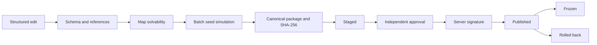

# Content Pipeline

Phase 9 implements the complete authoring and publication control plane. Zod catalog parsing, cross-reference and localization validation, authored-map validation, deterministic route simulation, canonical packaging, per-catalog SHA-256 hashes, structural diffs, staged approval, HMAC signing, production publication, freeze, and rollback are executable boundaries.

Content never executes arbitrary JavaScript. Daily challenges bind an immutable content and rules version for their full server-date window. Production publication cannot be triggered by Content Studio without validation and authorized approval.

## State flow

`ContentWorkspace` limits reads and writes to the declared catalog allow-list. The loopback HTTP boundary applies a global rate limit before routes are registered. Catalog saves use a revision hash and atomic replacement. Drafts and publication metadata live outside the authored `content/` tree and are ignored by Git. A freeze rejects further source and artifact writes.

`Content Studio` exposes structured fields rather than a raw JSON editor. Its six modules cover maps/objectives/regions, routes/rewards/progression, robots/modules and their deterministic runtime authority, enemies/AI/bosses, events/tutorial/localization, and daily fixed-content review. Undo/redo, dirty state, delayed draft autosave, import/export, diff retrieval, field errors, validation, packaging, and staging are integrated.

The public game API serves `GET /v1/content/manifest` and `GET /v1/content/versions/:version`. Only content that passed the same pipeline can enter the registry. The manifest binds content/rules versions, commit, counts, simulation evidence, catalog hashes, and artifact hash.

Production signing uses a server-only secret. The content gateway and admin API never send this secret to either browser.
